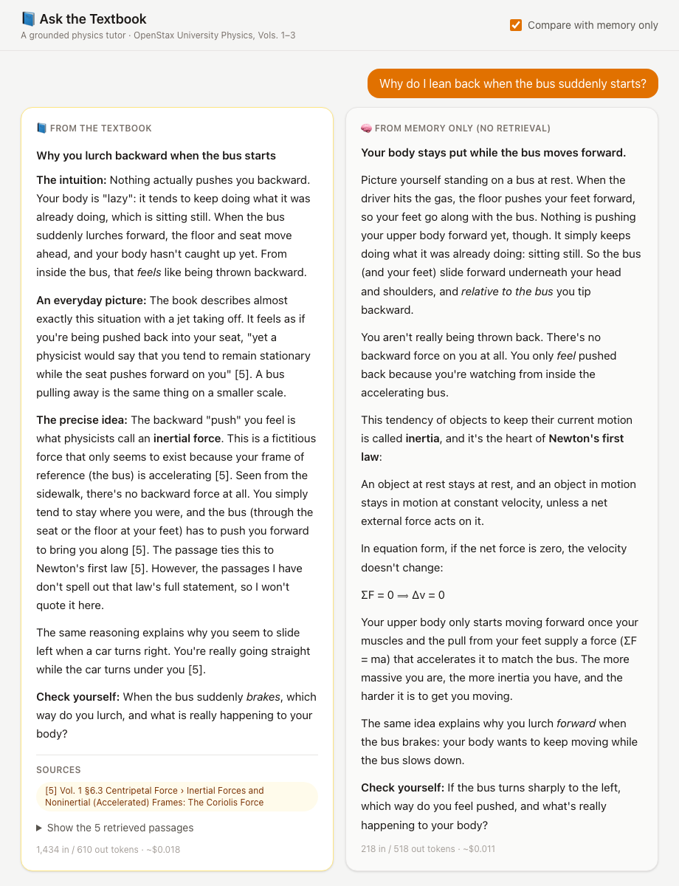
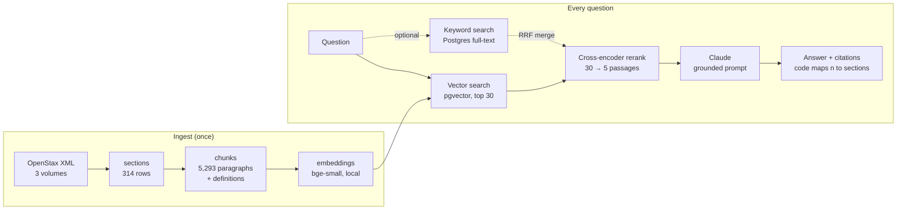

# Ask the Textbook

**A grounded physics tutor.** Ask a physics question in your own words and get a clear explanation (intuition first, an everyday example, plain words), where every claim is cited from a real textbook: OpenStax *University Physics*, Volumes 1–3.

It's a retrieval-augmented generation (RAG) system built from scratch in plain Python: no LangChain. Every retrieval layer is measured against an evaluation set, and the answers are tested for whether they follow the textbook or the model's memory.

<p align="center">
  
</p>
<p align="center"><em>Compare mode: the grounded answer (left) quotes and cites the book; the memory-only answer (right) can't be checked.</em></p>

## What it does

- **Explains like a good teacher:** intuition and an everyday picture first, then the precise idea, then a question to check yourself.
- **Cites its sources:** every claim points to a passage, shown as "Vol. 1 §6.3 Inertial Forces". You can open the retrieved passages and check them.
- **Says what it doesn't know:** when the passages don't cover part of a question, the answer says so instead of filling the gap from memory.

## How it works



1. **Retrieve:** a local bi-encoder (`bge-small-en-v1.5`) finds the 30 closest chunks in Postgres + pgvector. Keyword search (Postgres full-text) can run in parallel and be merged with Reciprocal Rank Fusion.
2. **Rerank:** a local cross-encoder (`ms-marco-MiniLM-L-6-v2`) reads the question and each candidate *together* and keeps the best 5.
3. **Augment + generate:** the 5 passages go into a prompt with grounding rules (facts only from the passages, cite `[n]`, say what's missing). Claude writes the explanation; code turns `[n]` into section labels and flags any citation that doesn't exist.

Interfaces: a **FastAPI** backend streaming NDJSON, a **Next.js** chat page, and a CLI. All three call the same `stream_answer()`.

## Results

**Retrieval** (55 questions over all three volumes; a hit = the right textbook section in the top 5):

| Method | Recall@5 | MRR | Everyday-wording questions |
|---|---|---|---|
| vector | 95% | 0.90 | 85% |
| keyword | 73% | 0.52 | 55% |
| hybrid (vector + keyword, RRF) | 91% | 0.82 | 85% |
| **vector + cross-encoder rerank** (default) | **98%** | **0.94** | **95%** |
| hybrid + cross-encoder rerank | 95% | 0.93 | 85% |

**What the experiments showed:**
- **Reranking cleans the top of the list.** Before adding it, we checked that every right answer was already in the top 20 (the reranker's ceiling); it then raised MRR from 0.89 to 0.95 on Volume 1.
- **Hybrid search helped on one volume and hurt on three.** With 3× more text, keyword search mixes up common words ("gun *kick back*" matched "*back* emf" in electric motors), so the default became vector + rerank.
- **The model already knows this textbook.** With no retrieval, Claude named the right section for 8/8 questions, better than the retriever's top-1, but reproduced 0/5 passages word for word. So answers are tested for *faithfulness*, not only correctness.
- **Planted facts:** six facts were changed inside a rolled-back database transaction. The memory-only answer used memory 6/6; the grounded answer reasoned from the passages 5/6 and pointed out where the planted value contradicted other passages.

Details, caveats, and every decision: [docs/DESIGN.md](docs/DESIGN.md). Raw reports: [evals/results/](evals/results/).

## Run it

Requirements: [uv](https://docs.astral.sh/uv/), Docker Desktop, Node.js 20+, an Anthropic API key.

```bash
# 1. Database + Python
cp .env.example .env              # add ANTHROPIC_API_KEY
docker compose up -d              # Postgres 17 + pgvector on localhost:5432
uv sync

# 2. Textbook source (text only, ~19 MB)
git clone --depth 1 --filter=blob:none --sparse \
  https://github.com/openstax/osbooks-university-physics-bundle.git data/openstax-physics
git -C data/openstax-physics sparse-checkout set META-INF collections modules

# 3. Build the index: structure -> chunks -> embeddings (~2 minutes, all local)
for v in 1 2 3; do
  uv run python -m tutor.ingest.load_sections --volume $v
  uv run python -m tutor.ingest.load_chunks --volume $v
done
uv run python -m tutor.ingest.embed_chunks

# 4. Ask
uv run uvicorn tutor.api:app --port 8000                          # backend
cd web && cp .env.example .env.local && npm install && npm run dev  # http://localhost:3100
# or: uv run python -m tutor.cli "Why do we see a rainbow after it rains?"
```

Each answer costs about $0.02.

**Evaluate:**

```bash
uv run pytest                                   # unit tests (no API calls)
uv run python evals/run_retrieval_eval.py       # retrieval: Recall@5/@10, MRR, by question type and volume
uv run python evals/contamination_probe.py      # what the model knows without retrieval
uv run python evals/compare_direct_vs_rag.py    # memory-only vs grounded, incl. planted facts
```

## Project layout

```
src/tutor/
  ingest/      structure.py (XML → sections), chunking.py + mathml.py (→ chunks), embed_chunks.py
  retrieve.py  vector / keyword / hybrid search, RRF, reranking
  answer.py    prompt, citations, grounded + memory-only answers
  api.py       FastAPI (NDJSON streaming)        cli.py   terminal
web/           Next.js chat page
evals/         eval set (55 cases) + experiment scripts + results
docs/          DESIGN.md (decisions), SCHEMA.md (tables)
```

## Data and license

Code: MIT. Physics content: [OpenStax *University Physics*](https://openstax.org/details/books/university-physics-volume-1), CC BY-NC-SA 4.0, downloaded during setup and not stored in this repo.
