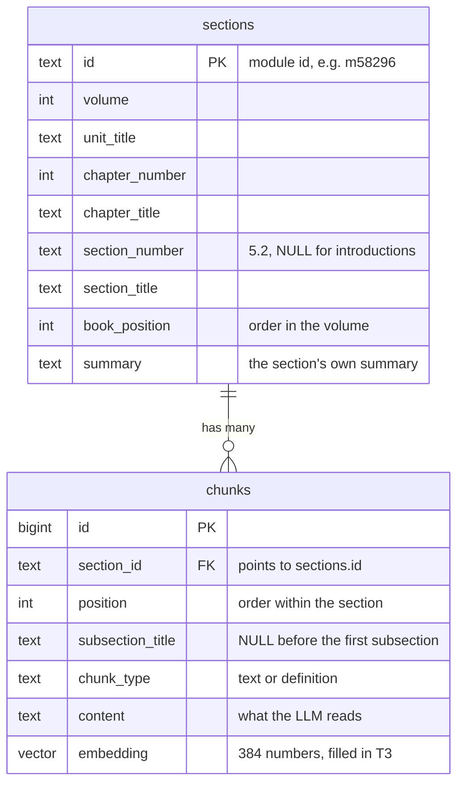

# Database schema

Two tables in Postgres (with the pgvector extension). Defined in [`db/schema.sql`](../db/schema.sql).



## How the book maps onto the tables

```
Volume 1
 └── Unit: Mechanics                          ┐
      └── Chapter 5: Newton's Laws of Motion  ├─ columns on `sections`
           └── Section 5.2: Newton's First Law┘  ← one `sections` row (one OpenStax module)
                └── Subsection: "Gravitation and Inertia"   ← `chunks.subsection_title`
                     └── paragraph, paragraph, …            ← one `chunks` row each
```

## `sections`: the book's structure (fixed)

One row per section (OpenStax "module"). Filled by `tutor.ingest.load_sections`, plus `summary` by `tutor.ingest.load_chunks`.

| Column | Example | Meaning |
|---|---|---|
| `id` | `m58296` | OpenStax module id (primary key) |
| `volume` | `1` | Which volume of *University Physics* |
| `unit_title` | `Mechanics` | Group of chapters |
| `chapter_number` | `5` | Counts on across units (Oscillations is 15, not 1) |
| `chapter_title` | `Newton's Laws of Motion` | |
| `section_number` | `5.2` | Text, so "5.10" ≠ "5.1". `NULL` for a chapter's Introduction |
| `section_title` | `Newton's First Law` | |
| `book_position` | `33` | Order within the volume, 1-based |
| `summary` | `- Inertia resists…` | The section's Summary bullets. Stored here (one per section) rather than as chunks; later it can find the right section first (hierarchical retrieval) |

## `chunks`: the searchable text (rebuilt when chunking changes)

Filled by `tutor.ingest.load_chunks`. Re-running replaces a volume's chunks.

| Column | Example | Meaning |
|---|---|---|
| `id` | `1042` | Auto-numbered primary key |
| `section_id` | `m58296` | Foreign key → `sections.id`. Volume, chapter, and section all come from there |
| `position` | `8` | Order within the section, 0-based |
| `subsection_title` | `Gravitation and Inertia` | The heading this chunk sits under. Used in citations and in front of the text when embedding |
| `chunk_type` | `text` | `text` = a paragraph (with its equations); `definition` = a glossary entry |
| `content` | `Mass is also related to inertia, …` | Readable text: math converted from MathML (`F⃗_net = 0⃗`) |
| `embedding` | `[0.012, -0.08, …]` | 384-dimension vector from the embedding model (T3) |

## Example rows

`sections`

| id | volume | unit_title | chapter_number | chapter_title | section_number | section_title | book_position |
|---|---|---|---|---|---|---|---|
| m58294 | 1 | Mechanics | 5 | Newton's Laws of Motion | *NULL* | Introduction | 31 |
| m58296 | 1 | Mechanics | 5 | Newton's Laws of Motion | 5.2 | Newton's First Law | 33 |

`chunks` (for m58296)

| position | subsection_title | chunk_type | content |
|---|---|---|---|
| 1 | *NULL* | text | Newton's First Law of Motion: A body at rest remains at rest or, if in motion, remains in motion at constant velocity unless acted on by a net external force. |
| 15 | Newton's First Law and Equilibrium | text | We can give Newton's first law in vector form: v⃗ = constant when F⃗_net = 0⃗ N. |
| 18 | Glossary | definition | inertia: ability of an object to resist changes in its motion |

## Useful queries

```sql
-- A chunk with everything needed for a citation
SELECT s.chapter_number, s.section_number, s.section_title, c.subsection_title, c.content
FROM chunks c JOIN sections s ON s.id = c.section_id
WHERE c.id = 1042;

-- How many chunks of each type
SELECT chunk_type, count(*) FROM chunks GROUP BY chunk_type;
```
